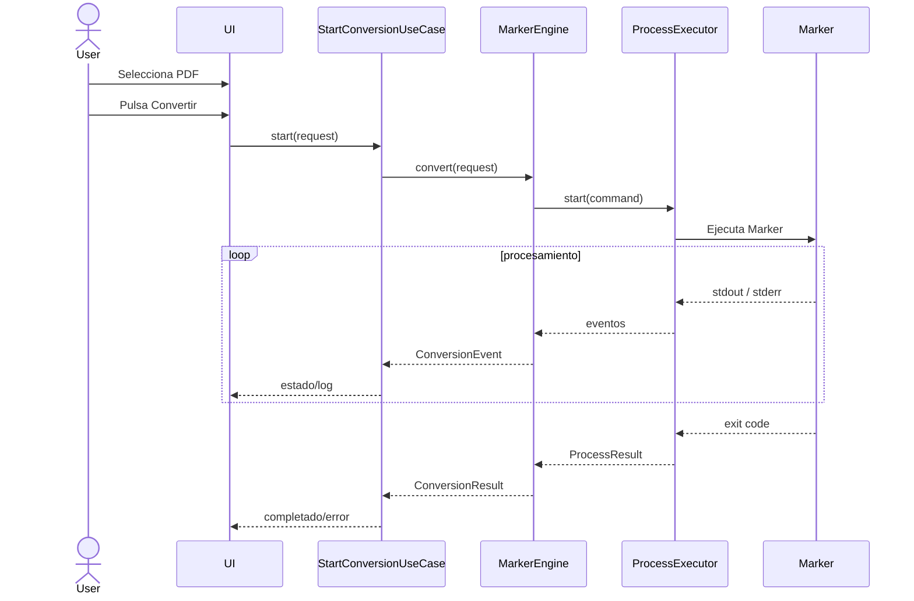

# ParseForge — Arquitectura primaria del MVP

> Documento de arquitectura inicial.  
> Estado: **Draft / MVP**  
> Plataforma inicial: **Windows**  
> Motor inicial: **Marker**  
> Nombre del proyecto: **ParseForge** (provisional)

---

## 1. Objetivo

ParseForge será una aplicación de escritorio para convertir documentos PDF a formatos editables, comenzando por **Markdown**, utilizando motores de procesamiento externos como Marker.

El objetivo principal del MVP es que una persona pueda:

1. Instalar ParseForge.
2. Instalar o seleccionar Marker sin utilizar PowerShell, `pip`, entornos virtuales ni configurar variables manualmente.
3. Arrastrar o seleccionar un PDF.
4. Elegir una carpeta de salida.
5. Iniciar la conversión.
6. Ver el estado y los logs del procesamiento en tiempo real.
7. Cancelar la conversión.
8. Abrir el resultado generado.

La aplicación debe ocultar la complejidad técnica del motor sin ocultar información útil sobre lo que está ocurriendo.

---

## 2. Principios del proyecto

### 2.1. Procesamiento local

Los documentos deben procesarse localmente siempre que el motor seleccionado lo permita.

ParseForge no necesita un backend propio para convertir archivos.

La conexión a Internet puede utilizarse para:

- descargar motores;
- descargar modelos;
- verificar actualizaciones;
- descargar actualizaciones de ParseForge.

Los documentos del usuario **no deben enviarse a servicios externos por defecto**.

### 2.2. Transparencia para el usuario

El usuario no debería necesitar conocer conceptos como:

- Python;
- `pip`;
- `.venv`;
- llama.cpp;
- Hugging Face;
- variables de entorno;
- comandos de consola.

ParseForge será responsable de administrar esas dependencias.

### 2.3. Motores desacoplados

ParseForge no debe depender directamente de Marker.

Marker será una implementación de un contrato genérico:

```text
ConversionEngine
```

En el futuro se podrán agregar:

```text
MarkerEngine
DoclingEngine
MinerUEngine
...
```

sin modificar la lógica principal de la aplicación.

### 2.4. Dependencias aisladas

Cada motor deberá tener su propio runtime y dependencias.

Ejemplo:

```text
engines/
├── marker/
│   ├── runtime/
│   ├── models/
│   └── engine.json
│
├── docling/
│   ├── runtime/
│   ├── models/
│   └── engine.json
│
└── mineru/
    ├── runtime/
    ├── models/
    └── engine.json
```

Nunca se compartirán paquetes Python entre motores si eso puede producir conflictos de versiones.

### 2.5. Arquitectura preparada para crecer, pero sin sobrearquitectura

El MVP debe implementar únicamente lo necesario para Marker, pero las interfaces principales deben permitir agregar nuevos motores sin rehacer el sistema.

No se crearán abstracciones que no tengan una razón concreta de existir.

---

# 3. Stack inicial

| Área | Tecnología |
|---|---|
| Lenguaje principal | Java 21 LTS |
| UI | JavaFX |
| Build | Maven |
| Tests | JUnit 5 |
| Mocking | Mockito |
| Logging | SLF4J + Logback |
| Serialización/configuración | Jackson |
| Procesos externos | Java `ProcessBuilder` / `ProcessHandle` |
| Empaquetado Java | `jlink` + `jpackage` |
| Instalador Windows | Inno Setup |
| Motor inicial | Marker |
| OCR / procesamiento | Marker + Surya |
| Inferencia CPU | llama.cpp |
| Runtime de motores | Python privado administrado por ParseForge |

JavaFX será responsable únicamente de la interfaz.

Marker, Surya, Python y llama.cpp pertenecen a la infraestructura de procesamiento y nunca deben mezclarse con el dominio de la aplicación.

---

# 4. Alcance del MVP

## Incluido

- aplicación Windows;
- una única ventana principal;
- selección de PDF;
- drag & drop;
- selección de carpeta de salida;
- detección de Marker instalado por ParseForge;
- instalación administrada de Marker;
- ejecución de Marker;
- captura de `stdout`;
- captura de `stderr`;
- logs visibles;
- estado actual de la conversión;
- tiempo transcurrido;
- cancelación;
- detección de éxito/error;
- apertura de carpeta de salida;
- configuración persistente;
- instalación/desinstalación de Marker desde ParseForge;
- soporte arquitectónico para motores futuros.

## No incluido en el MVP

- editor Markdown integrado;
- preview PDF/Markdown lado a lado;
- traducción;
- conversión EPUB;
- procesamiento por lotes;
- perfiles avanzados;
- sincronización cloud;
- cuentas de usuario;
- backend remoto;
- telemetría obligatoria;
- Docling;
- MinerU;
- plugins de terceros.

Estas funciones podrán agregarse posteriormente sin modificar el núcleo de la aplicación.

---

# 5. Clean Architecture

ParseForge utilizará cuatro capas principales:

```text
┌──────────────────────────────────────────────┐
│               Presentation                  │
│              JavaFX / Views                 │
├──────────────────────────────────────────────┤
│               Application                   │
│       Use Cases / Services / Ports          │
├──────────────────────────────────────────────┤
│                  Domain                     │
│      Entities / Value Objects / Rules       │
├──────────────────────────────────────────────┤
│              Infrastructure                 │
│ Marker / Files / Process / Downloads        │
└──────────────────────────────────────────────┘
```

La regla principal será:

> Las dependencias apuntan hacia el dominio, nunca hacia afuera.

El dominio no conoce JavaFX, Marker, Python, HTTP ni el sistema operativo.

---

# 6. Capas

## 6.1. Domain

Contiene conceptos centrales del sistema.

Ejemplos:

```text
Document
ConversionJob
ConversionStatus
ConversionEngineId
ConversionResult
OutputFormat
EngineState
EngineVersion
```

Ejemplo conceptual:

```java
public enum ConversionStatus {
    PENDING,
    PREPARING,
    RUNNING,
    CANCELLING,
    CANCELLED,
    COMPLETED,
    FAILED
}
```

El dominio no ejecuta procesos ni toca archivos directamente.

## 6.2. Application

Contiene los casos de uso.

Ejemplos:

```text
StartConversionUseCase
CancelConversionUseCase
InstallEngineUseCase
RemoveEngineUseCase
CheckEngineStatusUseCase
OpenOutputDirectoryUseCase
```

También define los **ports** que la infraestructura deberá implementar.

Ejemplo:

```java
public interface ConversionEngine {

    EngineDescriptor descriptor();

    EngineState getState();

    ConversionResult convert(
        ConversionRequest request,
        ConversionEventListener listener
    );

    void cancel();
}
```

Otro ejemplo:

```java
public interface EngineInstaller {

    void install(
        EngineDescriptor engine,
        InstallationListener listener
    );

    void uninstall(EngineDescriptor engine);

    boolean isInstalled(EngineDescriptor engine);
}
```

## 6.3. Infrastructure

Implementa los contratos definidos por Application.

Aquí viven:

```text
MarkerEngine
MarkerInstaller
PythonRuntimeManager
LlamaRuntimeManager
ProcessExecutor
FileSystemRepository
HttpDownloadClient
ConfigRepository
EngineManifestRepository
```

Ejemplo:

```text
ConversionEngine
       ▲
       │
 MarkerEngine
```

MarkerEngine puede cambiar completamente sin afectar a JavaFX ni al dominio.

## 6.4. Presentation

Contiene JavaFX.

Ejemplos:

```text
MainView
MainController
MainViewModel
EngineSettingsView
EngineSettingsController
```

La UI nunca debería ejecutar Marker directamente.

Incorrecto:

```text
MainController
    ↓
ProcessBuilder("marker_single")
```

Correcto:

```text
MainController
    ↓
StartConversionUseCase
    ↓
ConversionEngine
    ↓
MarkerEngine
    ↓
ProcessExecutor
```

---

# 7. Arquitectura general

```text
                         ┌─────────────────────┐
                         │      JavaFX UI      │
                         └──────────┬──────────┘
                                    │
                                    ▼
                         ┌─────────────────────┐
                         │    Application      │
                         │      Use Cases      │
                         └──────────┬──────────┘
                                    │
                          ConversionEngine
                                    │
                                    ▼
                         ┌─────────────────────┐
                         │    MarkerEngine     │
                         └──────────┬──────────┘
                                    │
                                    ▼
                         ┌─────────────────────┐
                         │   ProcessExecutor   │
                         └──────────┬──────────┘
                                    │
                   ┌────────────────┴────────────────┐
                   ▼                                 ▼
             Python / Marker                  llama-server
                   │
                   ▼
                 Surya
                   │
                   ▼
                Markdown
```

---

# 8. Flujo de conversión



---

# 9. Estado de una conversión

Cada conversión será representada por un `ConversionJob`.

Ejemplo:

```text
ConversionJob
├── id
├── inputFile
├── outputDirectory
├── engine
├── status
├── startedAt
├── finishedAt
├── outputFiles
└── error
```

Estados:

```text
PENDING
   ↓
PREPARING
   ↓
RUNNING
   ├──────────────► FAILED
   │
   ├──────────────► CANCELLING ──► CANCELLED
   │
   └──────────────► COMPLETED
```

Nunca se debe representar una conversión únicamente con un booleano `running`.

---

# 10. Progreso

Marker no necesariamente proporciona un porcentaje fiable para todas las fases.

ParseForge **no debe inventar porcentajes**.

El MVP mostrará:

- fase actual;
- actividad;
- tiempo transcurrido;
- logs;
- indicador indeterminado cuando no exista porcentaje real.

Ejemplo:

```text
Procesando LoveMaps.pdf

[████████████████████████]

Ejecutando OCR...
Tiempo transcurrido: 12:42

▾ Logs
```

Si posteriormente podemos obtener:

```text
127 / 318 páginas
```

entonces sí se podrá mostrar:

```text
39 %
```

mediante un parser específico del motor.

---

# 11. Eventos del motor

La infraestructura transformará los logs crudos del motor en eventos internos.

Ejemplo:

```java
sealed interface ConversionEvent {
}
```

Posibles eventos:

```text
EngineStarted
PhaseChanged
ProgressChanged
LogReceived
WarningReceived
OutputCreated
EngineStopped
```

Esto evita que JavaFX dependa de strings específicos de Marker.

---

# 12. ProcessExecutor

`ProcessExecutor` será uno de los componentes más importantes.

Responsabilidades:

- crear procesos;
- pasar argumentos de forma segura;
- configurar variables de entorno;
- capturar stdout;
- capturar stderr;
- detectar exit code;
- permitir cancelación;
- matar procesos hijos cuando sea necesario;
- controlar timeout;
- evitar bloqueo del hilo JavaFX.

Ejemplo conceptual:

```java
ProcessSpec spec = new ProcessSpec(
    executable,
    arguments,
    environment,
    workingDirectory
);
```

Nunca construir comandos concatenando strings provenientes del usuario.

Evitar:

```java
"marker_single " + userPath
```

Preferir:

```java
new ProcessBuilder(
    executable,
    inputPath.toString(),
    "--output_dir",
    outputPath.toString()
);
```

---

# 13. Concurrencia

Ninguna operación lenta debe ejecutarse en el JavaFX Application Thread.

Se ejecutarán en background:

- conversiones;
- descargas;
- instalación de motores;
- verificación de archivos;
- cálculo de hashes;
- actualización de modelos.

La UI recibirá eventos mediante mecanismos seguros para JavaFX.

---

# 14. Cancelación

Cancelar debe ser una operación real.

Flujo:

```text
Usuario
  ↓
Cancelar
  ↓
CancelConversionUseCase
  ↓
MarkerEngine.cancel()
  ↓
ProcessExecutor
  ↓
ProcessHandle
  ↓
procesos hijos
  ↓
proceso principal
```

Debe contemplarse que Marker puede crear procesos secundarios como `llama-server`.

La cancelación debe intentar:

1. cierre normal;
2. espera breve;
3. terminación forzada si continúa activo.

La aplicación nunca debería dejar procesos huérfanos intencionalmente.

---

# 15. Gestión de motores

`EngineManager` será responsable de:

```text
listar
instalar
verificar
actualizar
reparar
desinstalar
```

motores.

Interfaz conceptual:

```java
public interface EngineManager {

    List<EngineDescriptor> availableEngines();

    EngineState stateOf(EngineId id);

    void install(EngineId id);

    void uninstall(EngineId id);

    void repair(EngineId id);
}
```

Para el MVP:

```text
availableEngines()
    └── Marker
```

En versiones futuras:

```text
availableEngines()
    ├── Marker
    ├── Docling
    └── MinerU
```

---

# 16. Engine Manifest

Cada motor debe tener un manifiesto.

Ejemplo:

```json
{
  "id": "marker",
  "displayName": "Marker",
  "engineVersion": "PINNED_VERSION",
  "pythonVersion": "PINNED_VERSION",
  "entrypoint": "runtime/Scripts/marker_single.exe",
  "capabilities": [
    "PDF_TO_MARKDOWN",
    "OCR"
  ]
}
```

Las versiones reales se fijarán durante la implementación y deberán probarse antes de ser publicadas.

No utilizar dependencias flotantes como:

```text
pip install marker-pdf
```

en producción.

Utilizar versiones validadas:

```text
marker-pdf==X.Y.Z
```

---

# 17. Runtime de los motores

La aplicación no dependerá de Python instalado globalmente.

Cada motor tendrá un runtime administrado por ParseForge.

Conceptualmente:

```text
%LOCALAPPDATA%\ParseForge\
│
├── engines\
│   └── marker\
│       ├── runtime\
│       ├── models\
│       ├── bin\
│       └── engine.json
│
├── logs\
├── cache\
└── config\
```

Esto evita escribir datos mutables dentro de `Program Files`.

---

# 18. Separación entre aplicación y datos

Archivos del programa:

```text
C:\Program Files\ParseForge\
```

Datos modificables:

```text
%LOCALAPPDATA%\ParseForge\
```

Configuración de usuario:

```text
%APPDATA%\ParseForge\
```

Posible organización:

```text
Program Files
└── ParseForge
    ├── ParseForge.exe
    └── runtime-java

LOCALAPPDATA
└── ParseForge
    ├── engines
    ├── models
    ├── cache
    └── logs

APPDATA
└── ParseForge
    └── config.json
```

---

# 19. Instalador

El instalador tendrá inicialmente:

```text
Idioma
Ubicación de instalación
Crear acceso directo
Agregar al menú Inicio
Motores opcionales
```

Ejemplo:

```text
Motores

☑ Marker
  OCR avanzado y PDFs escaneados

☐ Docling
  Próximamente

☐ MinerU
  Próximamente
```

En el MVP únicamente Marker estará habilitado.

Los otros motores pueden aparecer únicamente cuando exista soporte real y probado.

---

# 20. Instalación de motores

La lógica de instalación no debe duplicarse entre el instalador y la aplicación.

Flujo:

```text
Installer
   │
   │ motores elegidos
   ▼
ParseForge Bootstrap
   │
   ▼
EngineManager
   │
   ▼
MarkerInstaller
```

Desde configuración:

```text
Settings
   │
   ▼
EngineManager
   │
   ▼
MarkerInstaller
```

Ambos caminos utilizan exactamente el mismo componente.

---

# 21. Descargas

El motor de descarga deberá:

- utilizar HTTPS;
- soportar progreso;
- soportar cancelación;
- utilizar archivos temporales;
- validar integridad;
- mover el archivo solamente después de validarlo.

Flujo:

```text
download.tmp
     ↓
SHA-256
     ↓
válido?
 ┌───┴────┐
 no       sí
 │         │
delete    install
```

Nunca ejecutar inmediatamente un archivo descargado sin validación.

---

# 22. Fuentes de dependencias

ParseForge podrá obtener componentes desde fuentes oficiales o paquetes preparados por el proyecto.

Ejemplos conceptuales:

```text
PyPI
GitHub Releases
Hugging Face
Distribución propia firmada/verificada
```

El usuario no necesita conocer la fuente.

Cada manifest debe definir:

```text
URL
versión
SHA-256
tamaño
licencia
```

---

# 23. Modelos

Los modelos grandes no deberían formar parte del repositorio Git.

Opciones:

```text
Instalador
    ↓
Marker seleccionado
    ↓
descargar runtime
    ↓
descargar modelos
    ↓
verificar
    ↓
instalar
```

El mismo sistema permitirá posteriormente:

```text
reparar modelos
actualizar modelos
eliminar modelos
```

---

# 24. Configuración

Ejemplo:

```json
{
  "language": "es",
  "outputDirectory": "C:/Users/User/Documents/ParseForge",
  "selectedEngine": "marker",
  "showAdvancedLogs": false
}
```

No almacenar:

- contraseñas;
- tokens;
- contenido de documentos.

Si en el futuro existen secretos, deberán almacenarse mediante mecanismos seguros del sistema operativo.

---

# 25. Logs

Se utilizarán dos niveles de logs.

## Logs visibles al usuario

```text
Preparando Marker...
Cargando modelos...
Procesando documento...
Conversión completada.
```

## Logs técnicos

```text
DEBUG
INFO
WARN
ERROR
```

Los logs técnicos estarán disponibles para diagnóstico.

Por defecto no se deberá copiar el contenido completo de los documentos a los logs.

---

# 26. Manejo de errores

No mostrar stack traces crudos como mensaje principal.

Ejemplo incorrecto:

```text
java.io.IOException...
```

Ejemplo correcto:

```text
No fue posible iniciar Marker.

ParseForge intentó ejecutar el motor pero el runtime
parece estar incompleto.

[ Reparar Marker ] [ Ver detalles ]
```

El detalle técnico puede contener el stack trace.

---

# 27. Tipos de errores

Crear categorías internas.

Ejemplo:

```text
ENGINE_NOT_INSTALLED
ENGINE_CORRUPTED
MODEL_MISSING
DOWNLOAD_FAILED
PROCESS_START_FAILED
PROCESS_TIMEOUT
PROCESS_CRASHED
OUTPUT_NOT_CREATED
PERMISSION_DENIED
DISK_FULL
USER_CANCELLED
```

Evitar basar toda la lógica en strings de error.

---

# 28. Seguridad

Reglas iniciales:

1. Nunca ejecutar comandos mediante concatenación de texto.
2. Nunca utilizar rutas recibidas del usuario como shell command.
3. Utilizar `ProcessBuilder` con argumentos separados.
4. Verificar hashes de binarios descargados.
5. Utilizar HTTPS.
6. Mantener motores aislados.
7. Evitar ejecución permanente como administrador.
8. Solicitar privilegios elevados únicamente cuando el instalador realmente los requiera.
9. No enviar documentos fuera del dispositivo por defecto.
10. No guardar contenido sensible en logs.

---

# 29. Privacidad

ParseForge deberá comunicar claramente:

```text
Los documentos se procesan localmente.
```

Si en el futuro se agrega un motor cloud, deberá ser:

- opcional;
- explícito;
- claramente identificado;
- separado de los motores locales.

Nunca cambiar silenciosamente de procesamiento local a remoto.

---

# 30. Interfaz principal del MVP

```text
┌─────────────────────────────────────────────┐
│ ParseForge                              ⚙     │
│                                             │
│          Arrastrá un PDF aquí               │
│                    o                        │
│             [ Seleccionar PDF ]             │
│                                             │
│ LoveMaps.pdf                                │
│                                             │
│ Salida                                      │
│ C:\...\Documents\ParseForge      [ Cambiar ] │
│                                             │
│ Motor                                       │
│ [ Marker ▼ ]                                │
│                                             │
│              [ CONVERTIR ]                  │
│                                             │
├─────────────────────────────────────────────┤
│ Procesando LoveMaps.pdf                     │
│                                             │
│ ███████████████████████████                 │
│ Ejecutando OCR...                           │
│ Tiempo: 12:31                               │
│                                             │
│ ▾ Logs                                      │
│ marker: ...                                 │
│ surya: ...                                  │
│                                             │
│ [ Cancelar ]             [ Abrir carpeta ] │
└─────────────────────────────────────────────┘
```

No llenar la pantalla principal de opciones.

Las opciones poco frecuentes irán en Settings.

---

# 31. Estructura inicial del repositorio

```text
ParseForge/
│
├── pom.xml
├── README.md
├── LICENSE
├── THIRD_PARTY_NOTICES.md
│
├── docs/
│   ├── ARCHITECTURE.md
│   ├── ADR/
│   └── diagrams/
│
├── installer/
│   └── windows/
│
├── scripts/
│   ├── build.ps1
│   └── package.ps1
│
└── src/
    ├── main/
    │   ├── java/
    │   │   └── dev/ParseForge/
    │   │       │
    │   │       ├── domain/
    │   │       │   ├── model/
    │   │       │   └── exception/
    │   │       │
    │   │       ├── application/
    │   │       │   ├── port/
    │   │       │   │   ├── in/
    │   │       │   │   └── out/
    │   │       │   └── usecase/
    │   │       │
    │   │       ├── infrastructure/
    │   │       │   ├── engine/
    │   │       │   │   └── marker/
    │   │       │   ├── process/
    │   │       │   ├── filesystem/
    │   │       │   ├── download/
    │   │       │   └── config/
    │   │       │
    │   │       └── presentation/
    │   │           └── javafx/
    │   │               ├── controller/
    │   │               ├── viewmodel/
    │   │               └── component/
    │   │
    │   └── resources/
    │       ├── fxml/
    │       ├── css/
    │       ├── icons/
    │       └── i18n/
    │
    └── test/
        └── java/
            └── dev/ParseForge/
```

---

# 32. Dependencias entre paquetes

Permitido:

```text
presentation
    ↓
application
    ↓
domain

infrastructure
    ↓
application
    ↓
domain
```

No permitido:

```text
domain → infrastructure
domain → JavaFX
application → JavaFX
domain → Marker
```

---

# 33. Testing

## Domain

Tests unitarios puros.

```text
ConversionJobTest
ConversionStatusTest
EngineVersionTest
```

## Application

Mockear ports.

```text
StartConversionUseCaseTest
CancelConversionUseCaseTest
InstallEngineUseCaseTest
```

## Infrastructure

Tests específicos:

```text
MarkerCommandBuilderTest
MarkerLogParserTest
ProcessExecutorTest
EngineManifestRepositoryTest
```

## Integration

Ejecutar un motor simulado.

No depender de Marker real para todos los tests.

Crear un ejecutable/script de prueba que:

```text
imprima logs
espere
genere un archivo
termine con exit code configurable
```

Esto permite probar:

- progreso;
- logs;
- éxito;
- error;
- cancelación;
- timeout.

---

# 34. CI

Pipeline inicial:

```text
checkout
   ↓
setup Java
   ↓
mvn test
   ↓
mvn package
   ↓
static checks
```

Posteriormente:

```text
tag
 ↓
build Windows package
 ↓
create installer
 ↓
GitHub Release
```

Los modelos y runtimes pesados no deberán formar parte del repositorio Git.

---

# 35. Versionado

ParseForge y los motores tendrán versiones independientes.

Ejemplo:

```text
ParseForge 1.2.0

Marker integration:
    Marker X.Y.Z

Docling integration:
    no instalada
```

Actualizar ParseForge no implica necesariamente actualizar Marker.

Actualizar Marker no debería requerir reinstalar ParseForge.

---

# 36. Licencias de terceros

El proyecto deberá mantener:

```text
THIRD_PARTY_NOTICES.md
```

Para cada componente:

```text
nombre
versión
proyecto
licencia
URL
```

Antes de redistribuir modelos o binarios se deberá verificar su licencia específica.

El código del proyecto y las dependencias externas deben mantenerse claramente separados.

---

# 37. ADR — Architecture Decision Records

Las decisiones importantes se documentarán en:

```text
docs/ADR/
```

Ejemplo:

```text
0001-use-javafx.md
0002-use-clean-architecture.md
0003-engine-isolation.md
0004-local-processing-first.md
0005-engine-runtime-location.md
```

Formato simple:

```markdown
# ADR 0001 — JavaFX

## Estado
Aceptado

## Contexto

## Decisión

## Consecuencias
```

Esto permite explicar por qué el proyecto tomó determinadas decisiones sin llenar el código de comentarios históricos.

---

# 38. Decisiones aceptadas para el MVP

## ADR-001

**Java será el lenguaje principal.**

## ADR-002

**JavaFX será la interfaz gráfica.**

## ADR-003

**Marker será el único motor implementado inicialmente.**

## ADR-004

**Los motores se ejecutarán como procesos externos.**

## ADR-005

**Cada motor tendrá dependencias aisladas.**

## ADR-006

**Los documentos serán procesados localmente por defecto.**

## ADR-007

**La aplicación no dependerá de Python instalado por el usuario.**

## ADR-008

**Los runtimes y modelos no se almacenarán en Git.**

## ADR-009

**Installer y EngineManager utilizarán la misma lógica de instalación de motores.**

## ADR-010

**La UI nunca hablará directamente con Marker.**

---

# 39. Decisiones pendientes

Estas decisiones NO bloquean el comienzo del desarrollo.

## TBD-001 — Distribución de Python

Evaluar:

- Python embeddable;
- runtime preparado por ParseForge;
- otro mecanismo reproducible.

## TBD-002 — Distribución de llama.cpp

Decidir si:

- descargar release oficial;
- generar bundle propio;
- descargarlo junto con Marker.

## TBD-003 — Distribución de modelos

Evaluar:

- descarga directa desde origen;
- mirror propio;
- bundle versionado.

## TBD-004 — Actualizaciones de ParseForge

Evaluar posteriormente:

- updater interno;
- GitHub Releases;
- instalador manual.

## TBD-005 — Firma de código

Evaluar antes de una distribución pública estable.

---

# 40. Plan de implementación

## Etapa 1 — Proof of Concept

Objetivo:

> Java puede ejecutar el Marker que ya funciona actualmente y mostrar sus logs.

Implementar:

- proyecto Maven;
- JavaFX;
- selector de PDF;
- botón Convertir;
- ruta temporal/configurable al Marker existente;
- ejecución en background;
- stdout/stderr;
- logs;
- cancelación.

No construir todavía el instalador de motores.

## Etapa 2 — Core limpio

Extraer:

```text
ConversionEngine
ConversionJob
ProcessExecutor
StartConversionUseCase
CancelConversionUseCase
```

Crear tests.

Marker pasa a ser:

```text
MarkerEngine implements ConversionEngine
```

## Etapa 3 — Engine Manager

Implementar:

```text
EngineManager
MarkerInstaller
EngineManifest
RuntimeManager
```

Marker deja de depender de una instalación manual.

## Etapa 4 — Packaging

Generar:

```text
ParseForge.exe
runtime Java
instalador Windows
```

Una PC limpia debe poder instalar ParseForge.

## Etapa 5 — Instalación transparente de Marker

Objetivo:

```text
Instalar ParseForge
       ↓
☑ Marker
       ↓
Descargar/configurar
       ↓
Abrir
       ↓
Convertir PDF
```

Sin PowerShell.

## Etapa 6 — Release MVP

Criterio de finalización:

> Una persona con una PC Windows limpia puede descargar ParseForge, instalar Marker desde la interfaz, seleccionar un PDF y obtener Markdown sin ejecutar comandos manuales.

---

# 41. Definición de éxito del MVP

El MVP está terminado cuando:

- [ ] ParseForge se instala en Windows.
- [ ] No necesita Java preinstalado.
- [ ] No necesita Python preinstalado.
- [ ] Marker puede instalarse desde ParseForge.
- [ ] Marker puede desinstalarse desde ParseForge.
- [ ] Se puede seleccionar o arrastrar un PDF.
- [ ] Se puede seleccionar una carpeta de salida.
- [ ] La conversión no congela la UI.
- [ ] Se muestran logs en vivo.
- [ ] Se puede cancelar.
- [ ] Los procesos hijos se cierran correctamente.
- [ ] Se informa claramente éxito o error.
- [ ] Se puede abrir la carpeta de salida.
- [ ] Los documentos se procesan localmente.
- [ ] Existen tests del dominio y casos de uso.
- [ ] El repositorio no contiene modelos gigantes ni runtimes innecesarios.
- [ ] Existe documentación de arquitectura.
- [ ] Existe documentación de licencias de terceros.

---

# 42. Regla principal para futuras features

Antes de agregar una función, preguntar:

> ¿Pertenece al núcleo de conversión o es una capacidad opcional?

Si es opcional, no deberá contaminar el dominio principal.

Ejemplo:

```text
EPUB export
Translation
Markdown preview
Batch processing
Cloud engine
```

deberán integrarse como capacidades desacopladas.

---

# 43. Visión posterior al MVP

Arquitectura futura posible:

```text
                       ParseForge
                          │
              ┌───────────┴───────────┐
              │                       │
         EngineManager          ExportManager
              │                       │
     ┌────────┼────────┐         ┌────┴────┐
     ▼        ▼        ▼         ▼         ▼
  Marker   Docling   MinerU    Markdown   EPUB
```

Más adelante:

```text
Document Pipeline

PDF
 ↓
Engine
 ↓
Structured Document
 ↓
Post Processing
 ↓
Markdown
 ↓
Exporter
 ↓
EPUB / HTML / etc.
```

No es necesario implementar este pipeline completo durante el MVP.

---

# 44. Resumen arquitectónico

ParseForge será:

- una aplicación Java de escritorio;
- con JavaFX;
- basada en Clean Architecture;
- Windows-first;
- local-first;
- sin backend obligatorio;
- con motores intercambiables;
- con runtimes aislados;
- con dependencias administradas por la propia aplicación;
- con Marker como primer motor;
- con procesos externos controlados de forma asíncrona;
- preparada para incorporar Docling y MinerU sin rehacer el núcleo.

La primera prioridad no es soportar muchos motores.

La primera prioridad es conseguir que:

```text
PDF
 ↓
ParseForge
 ↓
Marker
 ↓
Markdown
```

funcione de forma confiable, local y sin que el usuario tenga que abrir una terminal.

## Implementación de Stage 6 (0.1.0)

El contrato `ConversionEngine` tiene ahora implementaciones reales Marker y
MarkItDown. `MultiEngineManager` enruta operaciones a gestores independientes,
con locks y leases por motor. `PinnedPythonEngineInstaller` conserva el staging,
hashes y commit atómico existente; cada adaptador aporta su propio runtime.
MarkItDown instala CPython 3.12.10 y `markitdown[pdf]==0.1.8` bajo su directorio,
sin compartir archivos con Marker. La interfaz depende de perfiles/casos de uso,
no de Python, pip, flags o rutas internas. Selección y expansión son independientes;
solo motores READY pueden seleccionarse y la selección persiste con fallback.
El alcance continúa siendo PDF → Markdown local. Ver `docs/release/STAGE_6_RESULT.md`.

## Implementación de Stage 7 (0.1.0)

`MainController` consume `AnalyzeDocumentUseCase`, que ejecuta el puerto
`DocumentPreflightService` fuera del hilo JavaFX. La composición inyecta
`PdfBoxDocumentPreflight` (PDFBox 3.0.8). El dominio define `DocumentType` y
`DocumentPreflightResult`; la clasificación no depende de JavaFX ni de Python.
Un worker dedicado evita colas de archivos obsoletos. Cambiar de archivo
interrumpe el anterior y una revisión de selección descarta callbacks tardíos.
El timeout de 8 segundos libera la UI; una operación de PDFBox que no responda
inmediatamente a interrupción puede terminar después, sin publicar su resultado.
No hay caché persistente, OCR previo, renderizado ni subida de datos.

Se inspeccionan hasta 20 páginas, distribuidas entre primera y última. Cuarenta
caracteres alfanuméricos indican texto suficiente; 80% de páginas con texto
clasifica DIGITAL. Hasta 10% con texto y al menos 80% con imágenes sin texto
suficiente clasifica SCANNED; al menos 20% de cada clase clasifica MIXED.
El resto es UNKNOWN. Las imágenes se detectan como XObjects, también en Forms
acotados a ocho niveles; no se decodifican sus píxeles. La clasificación es
aproximada y puede omitir imágenes inline o confundir adornos y texto escaso.

`DocumentAdvice` produce recomendaciones sin mutar la selección. `ConversionMessages`
traduce códigos estructurados, conservando detalles en logs. `ConversionResult`
incluye un código opcional compatible con los constructores previos.
`ConversionStorageGuard` comprueba destino y unidad temporal privada para entradas
de 50 MiB o más, bloqueando únicamente con menos de 100 MiB disponibles. Es un
piso prudente, no una estimación de espacio total. Los Job Objects y leases siguen
siendo responsables del ciclo de procesos. Ver `docs/release/STAGE_7_RESULT.md`.
