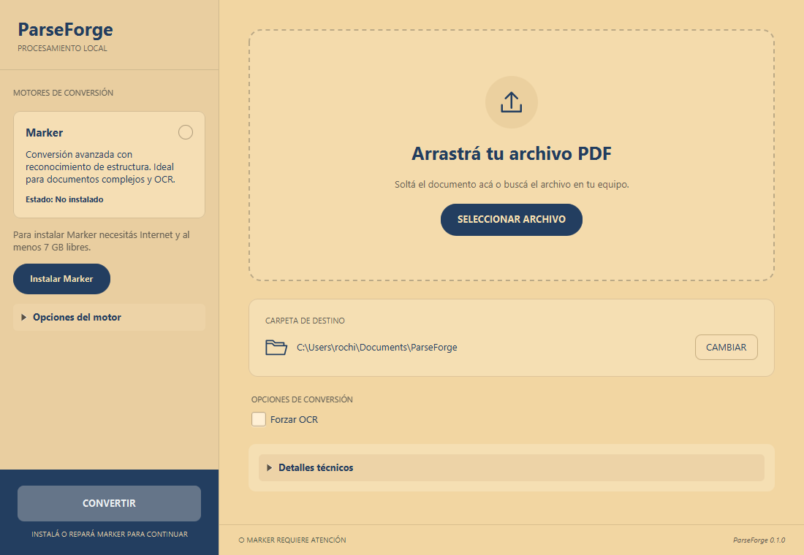

# ParseForge

ParseForge is a Windows-first desktop app that converts PDFs to Markdown using
Marker as its first engine. Documents are processed locally.

## Managed Marker

Open the **Motores de conversión** sidebar and click **Instalar Marker**. ParseForge
downloads pinned private CPython, llama.cpp CPU, locked packages and private
models. It validates SHA-256, prepares staging and activates
the runtime. Normal conversion needs no Python, Marker, pip, WinGet, manual
executable path or administrator privileges.

Allow **20 minutes or more** for installation or repair, depending on connection
and hardware; it may finish sooner. **Probar funcionamiento al finalizar (opcional)**
is unchecked by default. Select it to run Python, Torch, Marker CLI and llama.cpp
probes before activation. File/model integrity checks always run. If probes are
omitted, runtime compatibility is first exercised when converting a PDF. Probe
failures preserve the previous installation and a separate `*.health-check.log`
under `%LOCALAPPDATA%\ParseForge\logs`, including output and timeout details.

Marker installs under `%LOCALAPPDATA%\ParseForge\engines\marker`.
PDF text extraction runs in a single process to avoid Windows worker-pool
failures (`WinError 6` / `BrokenProcessPool`) when launched by the desktop app.
It uses approximately 3.2 GB; have at least 7 GB free for preparation/repair.
Internet is needed to install or repair. Model revisions are pinned; the Hugging
Face cache runs offline during conversion. Repair safely reinstalls. Uninstall
requires confirmation and removes private models/caches. Documents and outputs
remain independent of the engine directory.

## Download and install (0.1.0 candidate)

The candidate is **PACKAGE BUILT — VM VALIDATION PENDING**. It has not been
published as a GitHub Release. Local artifacts are in `build/release`:
`ParseForge-Setup-0.1.0.exe`, `ParseForge-0.1.0-win-x64.zip`, and `SHA256SUMS.txt`.
Verify SHA-256, double-click setup, choose language/folder/shortcuts and launch
ParseForge. The private Java runtime is included. Neither Java nor Python needs
to be installed globally. The portable ZIP also contains the runtime.

Setup installs for the current user under `%LOCALAPPDATA%\Programs\ParseForge`
without elevation. Settings live under `%APPDATA%\ParseForge`, engines/logs under
`%LOCALAPPDATA%\ParseForge`. Reinstall preserves mutable data. App uninstall
removes app files/shortcuts and retains engines, models, settings and documents.

Windows 10/11 x64 is required. Marker additionally needs Microsoft Visual C++
Runtime x64 and Internet for initial installation. Missing DLLs block engine
installation with the [official Microsoft download](https://aka.ms/vs/17/release/vc_redist.x64.exe).
Optional native health checks validate compatibility; clean Windows validation is pending.

Click **Instalar Marker** in the sidebar, wait for **Listo**, then
select/drop a PDF, choose output folder and press **Convertir**. Use **Forzar OCR**
for scanned pages. Downloads show actual bytes/smoothed speed and a per-file ETA only when
the measurement is stable; other phases show elapsed time without a percentage.
Times depend on connection and hardware. Marker uses ~3.2 GB and needs at least
7 GB free while preparing/repairing.

See [release build instructions](docs/release/BUILD.md),
[validation checklist](docs/release/VM_VALIDATION.md),
[Stage 4 result](docs/release/STAGE_4_RESULT.md) and
[third-party/model terms](THIRD_PARTY_NOTICES.md).



## FAQ

- **Do I need Java/Python?** No global installation; private runtimes are used.
- **Are documents uploaded?** No. PDFs are processed locally. Internet downloads
  runtimes, dependencies and models when installing/repairing the engine.
- **Why is Marker several GB?** OCR/inference models and CPU libraries are private.
- **How long does installation take?** Allow 20 minutes or more; it depends on
  Internet speed and hardware, and may finish sooner.
- **Can I use the models commercially?** Review the pinned model terms; model
  rights differ from ParseForge's code license.
- **Where are startup logs?** `%LOCALAPPDATA%\ParseForge\logs`. Logs rotate;
  startup errors provide the path. A native launcher failure before the JVM
  starts may require inspecting the installer log/runtime files.

## Development

JDK 21+ and Maven 3.9+:

```powershell
mvn javafx:run
mvn clean verify
```

Release: `.\scripts\release.ps1` downloads hash-verified pinned build tools,
runs tests, builds the runtime/image/setup/ZIP and generates hashes. No automatic
publishing, updater, Docling/MinerU or batch is included.

The Stage 5 UI uses a warm cream/navy palette, a selectable Marker card,
installation/repair controls in the sidebar, a versioned welcome preference and
independent vertical scrolling. Conversion is enabled only with a ready engine,
an accessible PDF and a usable output folder. See [Stage 5 validation](docs/release/STAGE_5_RESULT.md).

Opt-in native UI regression tests (requires a Windows desktop session):

```powershell
mvn test "-Dtest=Stage5UiTest" "-Dparseforge.uiTests=true" "-Dglass.win.uiScale=1.0"
```

Repeat with `1.25` and `1.5` for JavaFX scaling checks. Snapshots are written to
`target/stage5-ui/<scale>`. These use fixture engines and do not download models.

Optional isolated data root:

```powershell
mvn javafx:run "-Dparseforge.dataDir=$env:USERPROFILE\Documents\ParseForge-test"
```

`-Dparseforge.marker.override=C:\...\marker_single.exe` is an explicit
development-only override, not selected in the normal UI.

## Architecture and validation

Domain separates engines from conversion. Application ports/use cases coordinate
lifecycle and conversion. Infrastructure owns HTTPS, hashes, filesystem and
tracked processes. JavaFX depends on use cases with explicit injection.

See [Stage 3C result](docs/STAGE_3C_RESULT.md) and [ADRs](docs/ADR).
The [3B spike](docs/spikes/marker-autonomous-runtime.md) remains historical evidence.
Runtimes, models, wheels and validation outputs remain outside Git.

Privacy: ParseForge does not upload documents or inherit external LLM/API
credentials. Internet is used to install the engine and download models.
