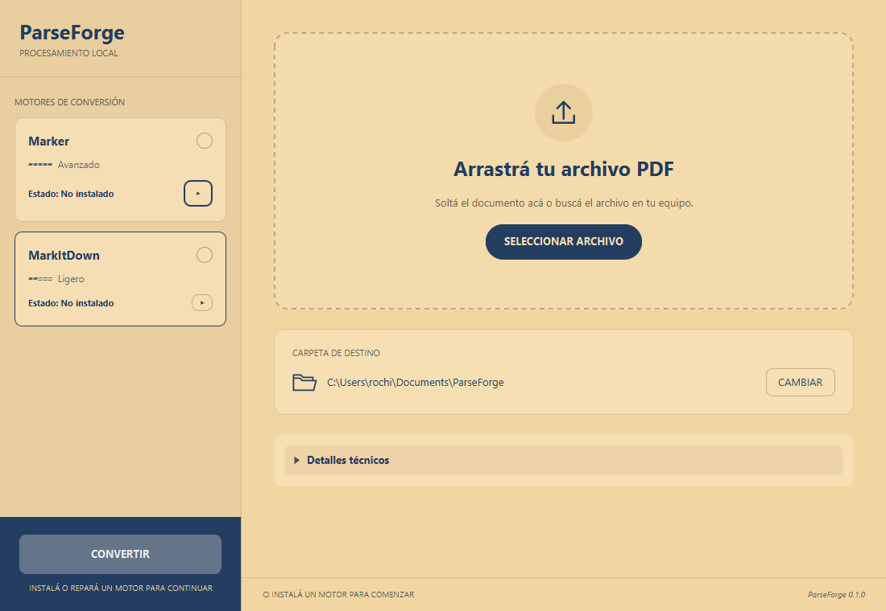

# ParseForge — Stage 6 result

Version: **0.1.0**. Date: **2026-10-01**, America/Buenos_Aires.
Status: implementation and host verification complete; **clean VM validation
pending, to be performed manually by the user**. No public release is published.

## Behavior delivered

- Marker and MarkItDown are genuine `ConversionEngine` implementations, selected
  through the common registry/use case. The UI knows no Python paths or CLI flags.
- MarkItDown 0.1.8 has its own CPython 3.12.10 x64 runtime, PDF-only locked wheels,
  immutable artifact URLs and SHA-256 checks. `engine.json` records engine/Python
  versions, bootstrap and package artifacts. No global Python/Java/WinGet is used.
- Common pinned/staged installation retains rollback, cancellation, diagnostics
  and atomic activation. Lifecycle leases, recovery and on-disk locks are per
  engine. Install, verify state, repair and uninstall are available independently.
- Compact cards show name, state, radio selection, scope indicator and chevron.
  Expanding one card collapses the other. Unavailable motors can still expand.
  Radio selection requires READY and remains independent of expanded details.
- Selection persists with a safe first-READY fallback; no ready engine means no
  selection and disabled conversion. Startup waits for both engine checks before
  restoring the preference. Temporary checks/repair retain the preferred ID.
- Ligero / Avanzado describe scope/resources with explanatory tooltips. Expanded
  details show local processing, descriptions, measured sizes and lifecycle actions.
  Only Marker has Forzar OCR. Keyboard, long-path tooltips and independent scrolling
  are preserved, including the minimum window.
- MarkItDown receives the chosen PDF/destination and explicit expected `.md` name.
  PDF pre-validation prevents upstream text fallback from treating corrupt PDFs
  as successes. Technical output remains separate from application status messages.
  Cancel/error returns the UI to a usable state.

## Measured runtime

The isolated spike measured **193,538,258 bytes installed** and **80,164,780 bytes
downloaded**. CPython is 31,400,978 bytes; packages plus bootstrap are 162,137,280.
Fresh preparation took 29.25 s on this host; small conversion took 2.203 s.
The real UI installation took 17.28 s. These measurements are contextual and
are not promised installation times. Core upstream Magika/ONNX detection assets
are included, with no separate heavy OCR/model download.

See [spike](../spikes/STAGE_6_MARKITDOWN_SPIKE.md),
[machine-readable evidence](STAGE_6_EVIDENCE.json) and
[license inventory](MARKITDOWN_LICENSE_INVENTORY.md).

## Validation evidence

`scripts/release.ps1` passed: **94 tests passed**, zero failures/errors, with two
opt-in desktop tests skipped in that build and executed separately at all three
scales. App-image, setup, portable ZIP and SHA256SUMS were rebuilt. Both packaged
startup and window smoke checks passed with the private Java runtime and isolated
data. The packaged JAR matches the verified build. The evidence JSON records logs,
package hashes, observed UI scales and captures.

- Unit/integration coverage exercises private commands, Unicode/spaces, expected
  outputs, failures/timeouts/cancellation, integrity/corruption/version checks,
  installation/repair/removal/rollback and selection persistence/fallback.
- Stage6UiTest passed at JavaFX scales **100%, 125%, 150%**, covering accordion,
  exclusive selection, uninstalled/ready cards, conversion routing, keyboard,
  options separation, restart/fallback and small-window scrolling.
- Stage5UiTest regression passed at the same three scales, preserving onboarding,
  installation/progress/repair/cancellation, PDF/destination UX and errors.
- Stage6HostSmoke used the actual app and real installer through JavaFX controls
  in `build/stage6-host`: install, digital/multipage Unicode conversion, full
  integrity and runtime health, restart persistence, repair, corrupt PDF error,
  cancellation, uninstall and reinstall passed. Cancellation left zero descendants.
- Forced termination of the JVM while private MarkItDown Python was active
  passed with the existing Windows Job Object; zero orphan processes remained.
- Existing Marker was detected READY. Real digital conversion (89.50 s), forced
  OCR (115.60 s) and cancellation (8.53 s) passed, with zero orphan processes.
  Its existing installed runtime was preserved; lifecycle regression also passed
  the automated staging/rollback/install/repair/uninstall tests.

Release artifacts under `build/release` (rebuilt 2026-10-02):

| Artifact | Bytes | SHA-256 |
| --- | ---: | --- |
| ParseForge-Setup-0.1.0.exe | 49,501,620 | f5026697db9e628f1ceee450b0e42eca62d0108fc29be1a93d3111d2fd90072a |
| ParseForge-0.1.0-win-x64.zip | 51,616,020 | 18d0fc46c61b1390a351867900ffe6ebc1feaf455e26120533b5045d001b0674 |

## Remaining acceptance check

The user chose to run the clean Windows VM validation manually. Follow
[VM_VALIDATION.md](VM_VALIDATION.md) using the rebuilt setup and matching hashes.
Actual Windows display scaling, OS prerequisites, installed-app lifecycle and
cross-engine independence on that VM remain unchecked until those results arrive.
Host probes and JavaFX scaling tests do not establish a VM pass.

## Follow-up — 2026-10-02

Ready engines can now be selected by clicking the card background, name, state
or capacity label as well as the radio. Internal buttons/options retain their
own actions, and unavailable/busy engines remain unselectable. Stage6UiTest
passed at 100%, including these click targets and control independence. The
release rebuild passed **101 tests** with two opt-in UI tests skipped; the
packaged UI startup passed with private Java. The prior PDF-suffix correction
is also included in this rebuilt setup/ZIP. VM validation remains pending.
