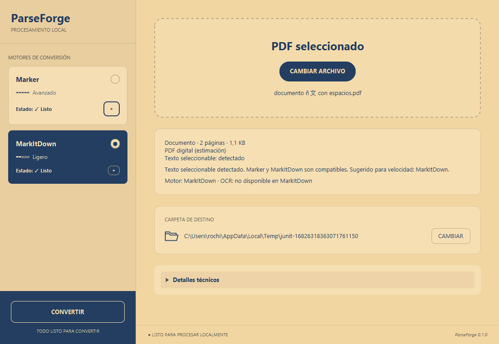
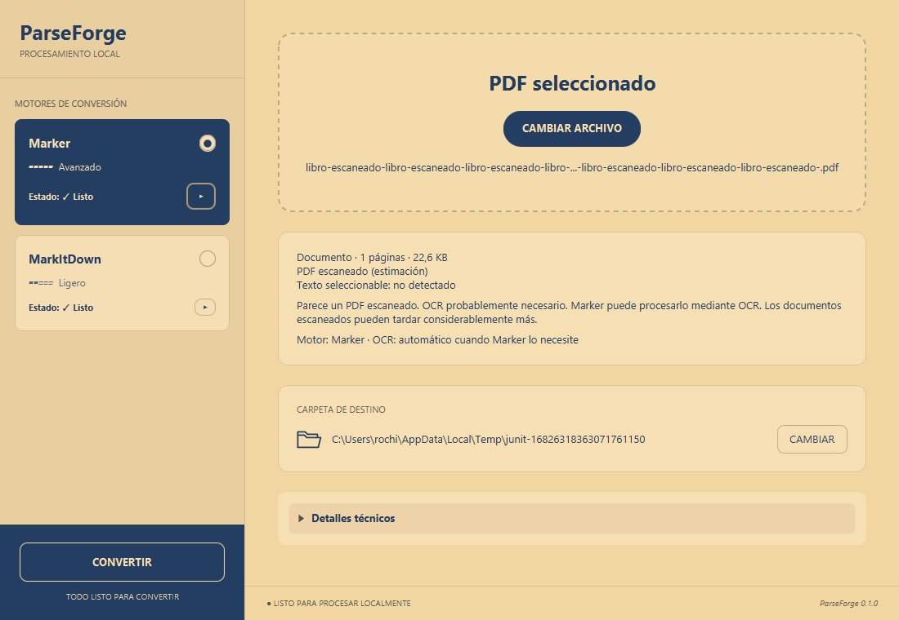
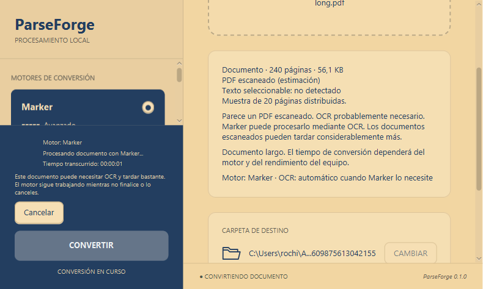

# ParseForge — Stage 7 result

Version: **0.1.0**. Date: **2026-10-03**, America/Buenos_Aires.
Status: **implemented and verified on the host; clean VM and full real scanned
book acceptance remain pending**. No public release was published.

## Delivered behavior

- Choosing or dropping a PDF starts local background inspection with a visible
  loading state, then pages, size, estimated type and selectable-text detection.
  The four categories are DIGITAL, SCANNED, MIXED and UNKNOWN. Blank or ambiguous
  pages are not automatically called scanned. No OCR or network request occurs.
- The selected-file area becomes compact. Filenames truncate with full-path
  tooltips; the summary and destination scroll within the existing workspace.
- Digital PDFs suggest ready MarkItDown for speed. Scanned and mixed PDFs suggest
  Marker. Suggestions never change the current engine: the explicit **Usar…**
  button does. Scanned + MarkItDown blocks conversion because it has no OCR;
  mixed + MarkItDown warns about omitted scanned content.
- Marker retains manual **Forzar OCR**. The normal scanned path uses Marker's
  automatic OCR, confirmed with a real image-only conversion. No automatic option
  mutation or extra confirmation screen was added.
- Long PDFs show a processing-time warning. The sidebar keeps actual engine,
  elapsed time, process phase and Cancelar visible even while scrolling in a small
  window. Marker/MarkItDown do not expose reliable page/OCR telemetry here, so the
  app shows indeterminate progress and genuine preparation/process/publication
  phases. It does not claim that OCR is currently running or invent a percentage,
  page counter or ETA. OCR advice is explicitly contextual.
- Completion shows the generated file/path, elapsed time and engine, with the
  existing open-folder action. Voluntary cancellation is a normal outcome,
  including an exception raised while a cancelled engine is shutting down.
- Typed errors distinguish invalid/inaccessible PDF, unwritable destination,
  missing/damaged engine, timeout, low disk space and general failure. Stack traces
  and exit details stay in technical logs. The UI retains at most 200k recent
  log characters; local rotating logs retain technical diagnostics separately.

## Architecture and documented heuristics

`MainController` → `AnalyzeDocumentUseCase` → `DocumentPreflightService` →
`PdfBoxDocumentPreflight`. The composition root injects PDFBox 3.0.8. Domain records
carry the structured result; application advice has no access to selection state
mutation. No new conversion engine, format, external OCR or cloud component exists.

- Up to 20 pages: inspect all. Above 20: inspect 20 distributed pages, using
  `floor(i × (pageCount − 1) / 19)`, including first and last.
- A page has sufficient text at **40 alphanumeric characters**; extraction stops
  after that threshold. No extracted document text is retained in the result.
- DIGITAL: text-page ratio **≥80%**.
- SCANNED: text-page ratio **≤10%** and image-page-with-insufficient-text ratio **≥80%**.
- MIXED: both text and image-with-insufficient-text ratios **≥20%**.
- UNKNOWN: other combinations, including blank/sparse documents without sufficient
  evidence. Selectable-text detection is separately true if any alphanumeric text
  was observed, even below the sufficient-text threshold.
- Image detection inspects XObjects and nested Form resources up to eight levels,
  without raster decoding. Inline images, decorative images and sparse text can
  affect this heuristic. The UI labels classification as an estimate.
- Long-document warning: **≥200 pages**.
- Analysis timeout: **8 seconds**. A dedicated worker is interrupted on selection
  change; queued obsolete work is removed and a revision token discards old results.
  PDFBox can take time to honor interruption; timeout releases the UI regardless.
- Protected PDFs and inspection/font/stream edge cases fail softly, allowing an
  engine attempt. Inaccessible files or unreadable PDF containers are blocked.
  Convertir waits during analysis, then becomes available on a nonblocking failure.
- No persistent or session cache: selecting the same path reinspects it.
- For files **≥50 MiB**, less than **100 MiB** free on the destination or private
  engine temporary volume is blocked. This modest floor is not a full OCR storage
  estimate; it is not applied to small files.

## Verification

The final `scripts/release.ps1` passed: **134 tests discovered, 131 passed,
zero failures/errors and three opt-in UI tests skipped**. Those UI suites were
run separately: Stage5UiTest, Stage6UiTest and Stage7UiTest each passed at JavaFX
scales **100%, 125%, 150%** (nine runs). The final validation-copy adjustment was
also checked with Stage5UiTest and Stage7UiTest at 100%.

Coverage includes digital/scanned/mixed/blank/sparse/empty/corrupt/protected PDFs,
missing files, spaced and Unicode paths, full versus sampled inspection,
replacement at the same path, interrupted/late results, timeout fallback, engine
recommendations, explicit selection, OCR warnings, progress/cancellation, errors,
small-window scrolling, long paths, storage thresholds and Stage 5/6 regressions.
The existing install/repair/uninstall, persistence and Windows Job Object tests
passed. Stage 5/6 UI fixtures inject neutral preflight; Stage 7 uses real PDFBox
fixtures plus controlled slow/failure cases.

Native FileChooser dialogs were not automated. The chooser and drop handler call
the same tested selection path. The drop handler was exercised with a synthetic
JavaFX dragboard payload. An attempted native Robot drag was inconclusive; actual
Explorer drag-and-drop remains a manual VM check.

The first test command used global Java 26 and hit the existing Mockito/Byte Buddy
compatibility limit. All successful release and UI runs used the project's pinned
Temurin JDK 21. No dependency workaround for the global JDK was introduced.

Packaged startup and window smoke passed with isolated settings and the private
Java runtime. An additional packaged-runtime preflight smoke verified all four
document categories using only shipped app dependencies and a test entry point.
The packaged app JAR matches the verified build. License collection includes
PDFBox, FontBox, PDFBox IO and Commons Logging notices.

## Real engines on this host

Existing managed installations were used without installing, repairing or removing
engines or changing user preferences. All documents were generated synthetic PDFs.

| Engine / case | Outcome | Process time |
| --- | --- | ---: |
| MarkItDown, 2 digital pages | completed, expected text | 1.606 s |
| MarkItDown, 240 digital pages | completed, expected text | 2.071 s |
| Marker, 2 digital pages | completed, expected text | 109.566 s |
| Marker, 2 image-only pages, automatic OCR | completed, recognized text | 170.324 s |
| Marker, 2 mixed pages | completed, expected text | 149.503 s |
| Marker, 240 image-only pages | cancelled, zero descendants | 15.851 s |
| MarkItDown, 240 digital pages | cancelled, zero descendants | 1.652 s |

Preflight measurements on the same fixtures: digital 48 ms, scanned 6 ms,
mixed 4 ms, blank 1 ms, 240-page digital 43 ms and 240-page scanned 21 ms.
These are contextual synthetic measurements, not performance promises. The long
fixtures reuse page content and are only about 56 KiB, unlike a real scanned book.
Corrupt-PDF preflight also returned the expected invalid-container error.

## Artifacts and evidence

Local output under `build/release`:

| Artifact | Bytes | SHA-256 |
| --- | ---: | --- |
| ParseForge-Setup-0.1.0.exe | 53,149,147 | 25a0b1cc62cf0bf88e121782c43914ea3461d0d7d6456c7889d741d60ac4a73f |
| ParseForge-0.1.0-win-x64.zip | 55,313,948 | 2a694304df7eaba406696dd2a55e28ecc8830d932b09771254a37a7e6d5d77c9 |

The machine-readable [evidence](STAGE_7_EVIDENCE.json) records logs, host timings,
package hashes, classification thresholds, sampling and remaining checks.
Fixtures and their generator are under `src/test/resources/documents` and
`src/test/java/dev/parseforge/infrastructure/document/PdfFixtures.java`.
Raw local evidence is under `build/stage7-*`.

## Remaining acceptance

Clean Windows VM, actual OS display scaling, Windows Explorer drag-and-drop and
a complete conversion of a real large scanned book remain pending. The 240-page
synthetic scanned case validates sampling/advice and real cancellation, not full
book completion. Follow [VM_VALIDATION.md](VM_VALIDATION.md). These pending checks
prevent claiming unconditional Stage 7 acceptance or a public release-ready build.
